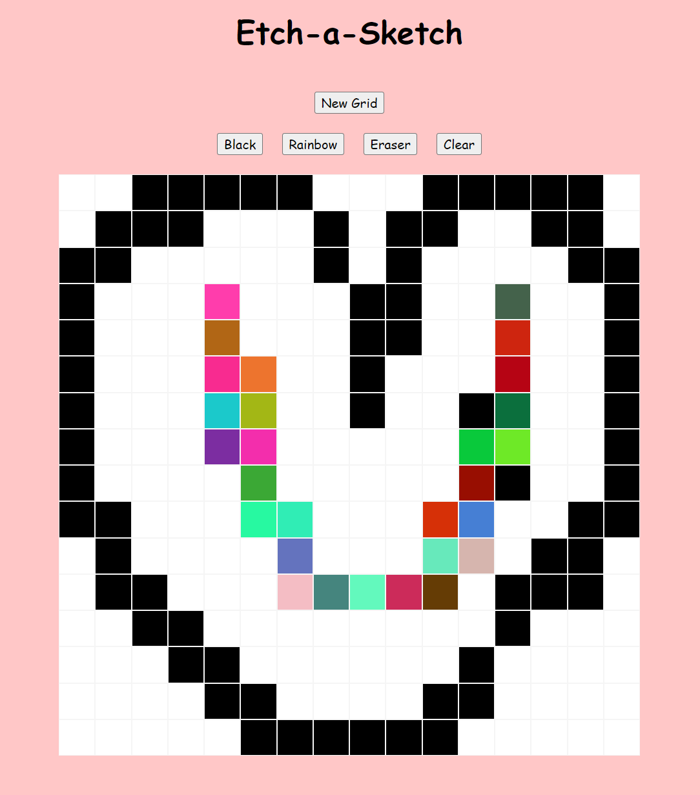

# Etch-a-Sketch
A simple sketchpad webapp similar to Etch A Sketch. Draw anything you like in the grid provided [here](https://raysonoon.github.io/etch-a-sketch/)

## How to draw
Hover cursor over the grid to highlight desired cell

## Features
- New Grid: change size of new grid (max: 100 cells per side)
- Pen colors:
    - Black
    - Rainbow (random color)
- Eraser
- Clear

## Skills
- Javascript, HTML, CSS

## What the app looks like
